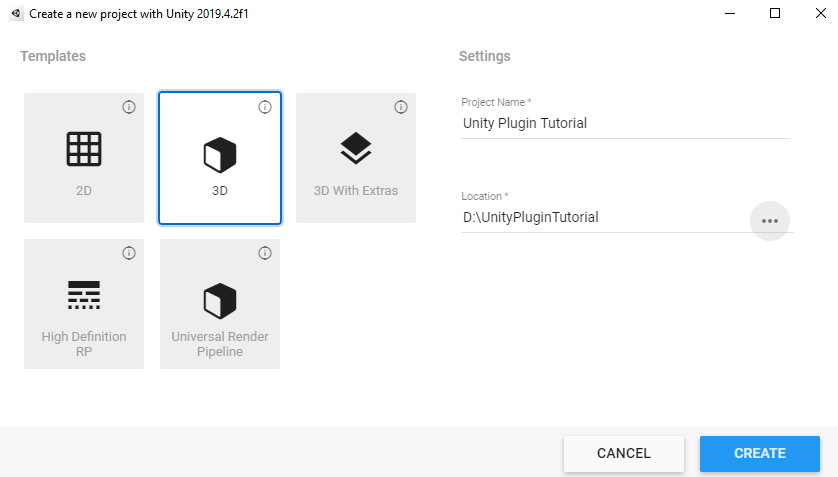
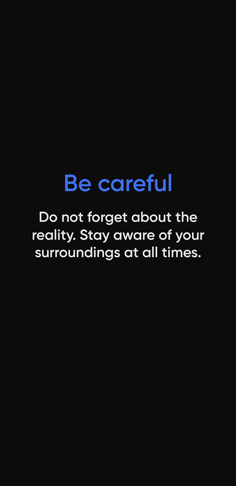
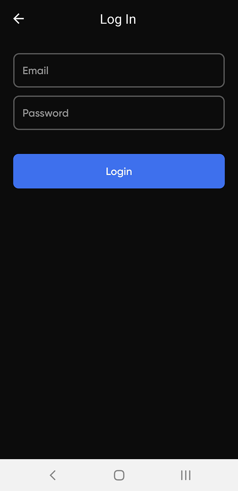
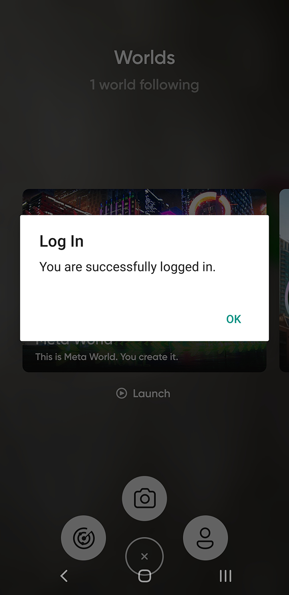

# Spheroid Unity Exporter

This tutorial will take you through the steps to 
export an AR scene created in Unity to Spheroid Script in order to become a part of code created 
in the Spheroid Demiurge IDE and then to be launched and played on mobile devices in the XR Hub super-app.

## Intro

Spheroid Unity Exporter has been designed to make the process of creating a scene 
easy and convenient for you. 

You use the Unity editor to position, rotate and scale objects in the scene and animate it. 
The plugin analyses the scene, remembers the position, angle and scale of objects, 
as well as their animation. 
After that, the plugin generates a scene graph in JSON, from which it generates the 
Spheroid Script resulting file. 
This file can be uploaded to the Spheroid Demiurge IDE and incorporated into 
an app.

## Create an account in the Spheroid Universe Platform

Before you create your app, you need to 
[create an account](https://spheroiduniverse.io/marketplace/register) in the Spheroid Universe Platform.

If you already have an account in the Spheroid Universe Platform, you can skip this step.


## Log in to the Spheroid Demiurge IDE

Now you have the access to all Platform services, including the Spheroid Demiurge IDE. 

Log in to the [Spheroid Demiurge IDE](https://demiurge.spheroiduniverse.io/ide), 
using the same email and password you used to register in the Platform.

## Create your app

Open the "Apps" tab and click the "Create" button. 


Enter the app name, leave the check on the "Create a layer corresponding to this app" box 
and click the "Create App" button. The app will be created along with the layer you will later 
use to publish the app into.


If the app doesn't get immediately created, and you get the error 
"Can't create an app because the app with the name 'xxx' already exists", 
it means the name you've chosen is already taken, so try another one.


## Download the source code

We have already prepared for you the source code you'll need to create a demo app. 
Download a zip archive from [our repo](https://github.com/SpheroidUniverse/SpheroidUnityExporter).

Then extract contents of the zip archive. You're now all set to upload the source code to your app!

## Upload the source code to Spheroid Demiurge IDE

Now, what you need to do is to upload the extracted files with source code to the IDE 
keeping the tree structure unchanged. 
So in the root of your app you need to have a folder named "assets",
as well as the four files.

```
(Your app name)
|--- assets
|   |--- audio
|       |--- apache.mp3
|       |--- music.mp3
|   |--- models
|       |--- apache
|           |--- apache.glb
|           |--- apache.scn
|           |--- model.json
|       |--- island
|           |--- island.glb
|           |--- island.scn
|           |--- model.json
|       |--- turtle
|           |--- android
|               |--- turtle.glb 
|           |--- ios
|               |--- turtle_baseColor.jpg
|               |--- turtle_normal.jpg
|               |--- turtle.scn
|           |--- bundle.json
|           |--- model.json
|--- app.json
|--- Client.spheroid
|--- ClientLibrary.spheroid
\--- SceneLibrary.spheroid
```

Currently, you can't upload a whole zip or a folder to the IDE 
but you can upload multiple files at once by a single drag-n-drop.

Open the "IDE" tab and select your app in the dropdown list.

Create the "assets" folder: right-click the app name and select the "Create a folder" option, 
then, when the dialog comes up, enter "assets" and click "OK". 
In this way, create each folder in the tree structure. There will be several folders where we will
put models and sounds we would like to use in the scene.

Each model folder contains:

- a "*.glb" model file for the Android version of the XR Hub app
- a "*.scn" model file for the iOS version of the XR Hub app (will be released soon)
- a "model.json" file that connects each model file to the specific platform:

```
{ 
  "ios": "./*.scn",
  "android": "./*.glb"
}
```

For each folder, left-click the folder to expand it. The text "Drag-n-drop files here to upload" 
will appear on the right. Drag-n-drop the files from the corresponding folder 
on your local PC.

Then, left-click the root folder (with the same name as your app) to expand it 
and drag-n-drop "app.json" and "Client.spheroid" files.


Drag-n-drop "ClientLibrary.spheroid" and "SceneLibrary.spheroid" files
that provide the means for the files exported from Unity to run (more on this a little later).

You're done! Now you can proceed to creating a scene in Unity.

## Create a scene in Unity and export it

For a start, you need to create a new project in Unity.
In this project, we will create a scene and then markup it and export it to Spheroid Script
using the plugin.

If you want to make things quicker, you can open the sample project we have prepared 
(see the "Unity Project" folder in the zip archive) and skip the scene creation and markup. 

### Create a scene

Create a new scene in Unity:


Select a 3D template:



Place the objects on the scene, rotate and scale them. Add animations if you'd like.
In the sample project, we have add an animation to the "Helicopters" node to make all
nested nodes rotate.


### Import the plugin

You can find the current version of plugin in the zip archive you have downloaded in the "packages"
folder".

Import the package into your project in Unity:


When the dialog comes up, click "Import".

You will see the new "Spheroid Universe" tab has appeared in the menu:


If you get a conflict of Newtonsoft JSON library,
just delete the folder with the Newtonsoft JSON plugin from the Spheroid Universe Exporter folder.


### Markup the scene

The plugin provides three components for the scene markup:

1. SpheroidModel. Describes a model, its sound and animation.
   
    - Model Path. A path to the model file relatively to the app root in the Spheroid Demiurge IDE.
    - Sound Path. A path to the model sound file relatively to the app root. This sound is 
    positioned, i.e. it will be bound to the model node position. Commonly used for such sounds,
    as steps, engine, etc.
    - Animation Name. If a model contains a built-in animation, you can specify the animation name,
    and it will be played in the app. Animation will be cycled.
    - View Distance. When the distance in metres between the user and the model is less
    than specified, model is downloaded and appears on the scene in the app.
    - Export. Indicates if this object needs to be exported to the scene graph.

2. SpheroidAudio. Describes a non-positioned sound.

    - Sound Path. A path to the model sound file relatively to the app root. 
    This sound is non-positioned. Usually used for background sounds and event sounds.
    - Export. Indicates if this object needs to be exported to the scene graph.

3. SpheroidNode. Describes a node and its sound.

    - Sound Path. A path to the model sound file relatively to the app root. This sound is 
    positioned, i.e. it will be bound to the node position. Commonly used for such sounds,
    as steps, engine, etc.
    - Export. Indicates if this object needs to be exported to the scene graph.

These components are necessary to help the plugin generate the scene graph and 
understand which kind of object needs to be created.

Note that plugin reads and remembers only information about the object placement 
on the scene but not about the model itself.
We have added the helicopter model and the turtle model to the Unity scene only 
for demonstration.
We could have used primitives instead. However, it is essential to specify the right
paths to the model files in the Spheroid Demiurge IDE.

#### Model

Select the GameObject containing a model and add a SpheroidModel component. 
Repeat this for each GameObject containing a model.


Fill in all the component fields. Note that path to the file should start with "/".


#### Background sound

If you would like to add a background sound, create an empty GameObject:


Add a SpheroidAudio component and specify the path to the audio file in your app 
in the Spheroid Demiurge IDE relatively to the root:


The markup stage is finished. Now we need to export the scene to Spheroid Script.

### Export the scene

In the menu, click the "Spheroid Universe" tab.


First, click "Export to JSON". The "scenegraph.json" file will be generated.
You will see in the console: 


Second, click "Export to Spheroid Script". The "Scene.spheroid" file will be generated.
You will see in the console: 


You can find generated files in the "out" folder in your Unity project:


This sums up the work in Unity.

## Set everything up in the Spheroid Demiurge IDE

Drag-n-drop the "Scene.spheroid" resulting file generated by the plugin into the root folder
in the Spheroid Demiurge IDE:


The "Scene.spheroid" file contains script that, while running on your mobile device,
will create and place the objects in the same way they
were placed in the Unity scene. 
However, this script is not independent. To run, it needs the special library. 
You have already uploaded it to your app in the Spheroid Demiurge IDE in 
"ClientLibrary.spheroid" and "SceneLibrary.spheroid" files.

Every time you use the exported from Unity scene you will also need to copy the
"ClientLibrary.spheroid" and "SceneLibrary.spheroid" files to your app.

You also will need to specify the paths to "Scene.spheroid", "ClientLibrary.spheroid" and 
"SceneLibrary.spheroid" files in the "app.json".
In the source code, we have already done it for you:


We have also already prepared the code that will create and launch the scene.
You can see it in the "Client.spheroid" file:

```
fun main() {
    startScene(createScene())
}
```

Now you can proceed to publishing your app.

## Publish your app

Click the "Publish" button in the top menu and, when the dialog comes up, keep the default settings, 
and click the "Publish" button at the right bottom of the dialog.


If the publication has been successful, you will see two info messages in the "Build" tab in the bottom pane. 
Congratulations, you have published your app!


If you don't see two info messages, or you see error messages instead, 
check you've followed the previous steps accurately and, if so, 
[write us an issue](https://spheroiduniverse.github.io/SpheroidScript/submit-an-issue.html), 
and we will help you solve the problem.

## Launch your app on your mobile phone

Now as you have your app built and published, it's time to run it on your mobile phone.

Download the XR Hub Android mobile app either by 
[following the Google Play link](https://play.google.com/store/apps/details?id=io.spheroid.spheroidandroid) 
or by scanning the QR code:


|  |  |  |  |
| --- | --- | --- | --- |
|  |  |  |  |

Currently, XR Hub works on the Android devices that [support ARCore](https://developers.google.com/ar/discover/supported-devices) 
only. iOS version of the app will be released soon.

Launch the XR Hub app on your phone.

|  |  |  |  |
| --- | --- | --- | --- |
|  |  |  |  |

Tap the menu button in the bottom center, then tap the account icon and 
log in to the app using the same email and password you used to register in the Platform.

|  |  |  | 
| --- | --- | --- | --- |
|  |  |  |  |

When you're authorized, swipe right through the list of worlds to find the world your app 
has been published into (world is called "layer" in the Spheroid Demiurge IDE). 
Note that if you're not logged in, you won't see the world, 
because the worlds created by developers are private. 
In the later tutorials you will learn how to add testers to your layer aka world.

|  |  |  |  |
| --- | --- | --- | --- |
|  |  |  |  |

When you've found your world, tap the "Launch" button, and your app will run.
Congratulations, you have successfully run your app in the XR Hub! 

Now you can try out some changes to the scene, export it and see for yourself how the changes apply.
For example, you can add the "island" model to the scene (you can find it in the "assets" folder).

## Troubleshooting

If you have encountered any problems, please let us know by 
[submitting an issue](https://spheroiduniverse.github.io/SpheroidScript/submit-an-issue.html), 
we will make sure to help you find the solution. Please don't hesitate to contact us, 
as your issues and our replies will help to make our platform better and will be valuable 
to other developers.

## What's next?

- [Spheroid Script Documentation](https://spheroiduniverse.github.io/SpheroidScript/)
- [Got a question? Submit an issue on GitHub](https://spheroiduniverse.github.io/SpheroidScript/submit-an-issue.html)


